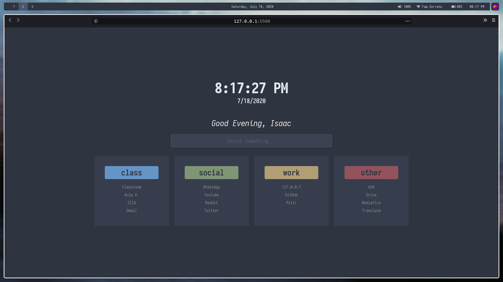

# Minimalistic start page

A simple startpage for any browser that support a custom startpage. On small screens, the grid changes to 3x1 or 2x2 but the intention of this program is to work on a screen with a <720p display.




### Features
- Basic clock and date.

- DuckDuckGo search box.

- Greetings based on the time of the day.

- Preferred link shortcuts.

- Easy to customize theme that can be change in the `style.css` file.

### Customization
All things can be changed based of the simplicity of this project.

`style.css` have all the style of the document like:

- Current theme: Nord/Atom One Dark mix

```
--bg: #2e3440;
--bg2: #3b4252;
--bg3: #6b748b;
--fg: #e5e9f0;
--purple: #b48ead;
--blue: #7dbeff;
--green: #a3be8c;
--orange: #ebcb8b;
--red: #bf616a;
```

  

- Greetings name
	The greetings displayed can be changed in the `main.html` file under the `<div id="welcome"></div>` part, it's Javascript that check what time is it and display the correct greeting.

- Shortcuts
The .html file contains several divs to accommodate the shortcuts of each section. As simple as putting the link to redirect and the name of the page.
```
<div  class="links-wrapper">
	<div  class="school-links">
		<h1>class</h1>
		<a  class="mid"  href="www.link-page.com">Title Page</a>
	</div>
	
	...
</div>
```

## Credits
[Nord theme](https://www.nordtheme.com/) color scheme.

[/r/unixporn](https://www.reddit.com/r/unixporn/) involved me in the ricing area.

[/r/startpages](https://www.reddit.com/r/startpages/) inspired me to create a custom startpage from scratch and publish it to the subreddit.
